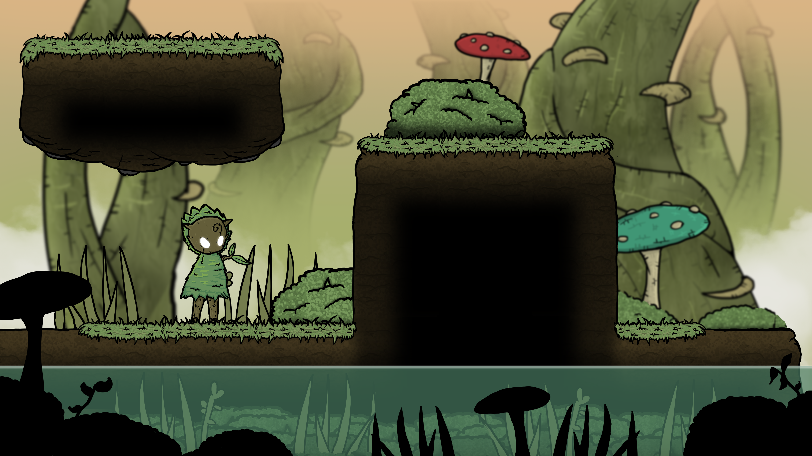

# Concept Art



<figure><figcaption>
Direção de Arte e Ancião da Natureza
</figcaption></figure>

<figure><figcaption>
Concept de uma das Aldeias da Natureza - By Vinícius Alves
</figcaption></figure>

<figure><figcaption>
Exploração dos cenários / tilemaps - By Vinícius Alves
</figcaption></figure>

<figure><figcaption>
Mushrooms Props - By Vinícius Alves
</figcaption></figure>

<figure><figcaption>
Bushes Props - By Vinícius Alves
</figcaption></figure>

<figure><figcaption></figcaption></figure>

<figure><figcaption></figcaption></figure>

<figure><figcaption></figcaption></figure>

<figure><figcaption></figcaption></figure>

<figure><figcaption></figcaption></figure>

<figure><figcaption></figcaption></figure>

<figure><figcaption></figcaption></figure>



<figure><figcaption>
Art Finalization - By Vinícius Alves
</figcaption></figure>

<figure><figcaption></figcaption></figure>

<figure><figcaption></figcaption></figure>

<figure><figcaption></figcaption></figure>

<figure><figcaption></figcaption></figure>

<figure><figcaption></figcaption></figure>

<figure><figcaption></figcaption></figure>

<figure><figcaption></figcaption></figure>

<figure><figcaption></figcaption></figure>

<figure><figcaption></figcaption></figure>

<figure><figcaption></figcaption></figure>

<figure><figcaption></figcaption></figure>

<figure><figcaption></figcaption></figure>

<figure><figcaption></figcaption></figure>

<figure><figcaption></figcaption></figure>

<figure><figcaption></figcaption></figure>

<figure><figcaption></figcaption></figure>

<figure><figcaption></figcaption></figure>



<figure><figcaption>
Inimigos do elemento Natureza e Terra, exploração do inimigo Golem de Pedra
</figcaption></figure>

<figure><figcaption>
Exploração de inimigos do elemento Natureza
</figcaption></figure>

<figure><figcaption>
Exploração de inimigos do elemento Natureza
</figcaption></figure>

<figure><figcaption>
Exploração de inimigos do elemento Natureza e Terra
</figcaption></figure>

<figure><figcaption>
Exploração de inimigos do elemento Natureza - By Manuella Garcia
</figcaption></figure>

<figure><figcaption>
Exploração de inimigos do elemento Natureza - By Manuella Garcia
</figcaption></figure>

<figure><figcaption></figcaption></figure>



<figure><figcaption></figcaption></figure>

<figure><figcaption></figcaption></figure>

<figure><figcaption></figcaption></figure>


