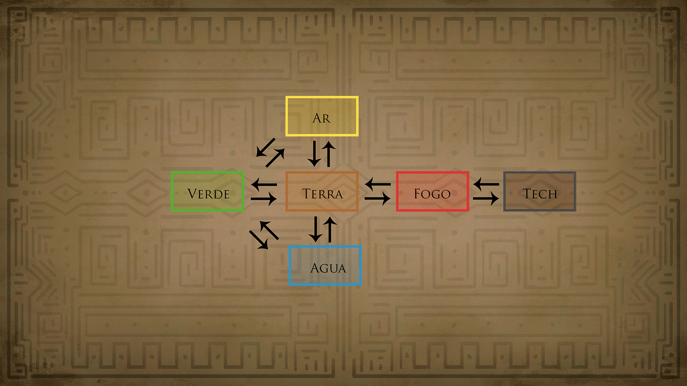

# Elementos e Regiões

<figure><figcaption></figcaption></figure>

<strong>Elemento Planta - Região Verde - Parte da DEMO</strong>

_Terra, Floresta (próximo à água), pedras, minérios, montanhas e cavernas. Insetos, animais e criaturas endêmicas à região, fungos entre outros. Sinergia com os elementos de Água e Terra._

**Grutas e Cavernas:**

* Gruta do Descobrimento;
* Gruta da Realização;
* Caverna dos Desejos;
* Gruta da Vidente;
* Gruta das Águas - Acesso para a região Azul e Atalho para a Vila dos Esporos - Distrito do Decaimento / Reciclagem. \\

**Clareiras:**

* Clareira Luminosa - Local de Descanso e Meditação do Ancião das Plantas;
* Clareira da Observação - Observatório - Acesso para a altitude das copas, caminho para a região Marrom;

**Copas das Árvores:**

* Alto da Mata / ou / da Floresta;
* Copa da Orientação - Caminho de Acesso para a região Branca, Vila da Contemplação e dos Astros;

\
**Vilas e Aldeias:**

* Vila das Flores - Distrito dos Brotos;
* Vila dos Esporos - Distrito do Decaimento / Reciclagem;
* Aldeia Ancestral
* Aldeia dos Espinhos - ou Vinhas - Borda defensiva e Proteção do altar do Elemento Terra;
* Aldeia Símia - Alto da Mata / OU / Floresta;
* Vila dos Jardineiros;

Elemento Terra - Região Marrom

_Terra, Floresta (próximo à água), pedras, minérios, montanhas e cavernas. Insetos, animais e criaturas endêmicas à região, fungos entre outros. Sinergia com os elementos de Água, Fogo além o da Natureza._

**Grutas e Cavernas:**

* Gruta das Preciosidades\\

**Clareiras:**

* Pedreira.\\

**Copas da Montanha:**

* Observatório da Gárgula;
* Alto da Cordilheira.\\

**Vilas e Aldeias:**

* Vila dos Roedores;
* Aldeia das Preciosidades - Distrito Pepitas, Brilhante…
* Vila dos Pedregulhos;
* Vila da Mina - Caminho para o interior da Montanha, Magma Forja;

Elemento Água - Região Azul

_Água. Ambiente húmido, criaturas e plantas aquáticas, cavernas úmidas, pântanos, fungos etc. Sinergia com elementos da Terra além da Natureza._\\

**Grutas e Cavernas:**

* Caminho das Águas - Acesso a Gruta das Águas e caminho para a região da Terra, Acesso para a Vila dos Esporos - Distrito do Decaimento / Reciclagem.\\

**Vilas e Aldeias:**

* Aldeia do Pântano Lamacento / ou / Aldeia Lamacenta;
* Vila das Águas Dançarinas;
* Vila da Foz Delta - Deságue - Porto e possível expansão marítima futura;
* Vila dos Sapos - Distrito Girino;
* Vila Salamandra.\\

**Ideias de Lugares:**

* Hidrelétrica;
* Vale das Lamentações.

Elemento Ar - Região Amarela

Vento, regiões altas e montanhosas. Possui sinergia com o com o Vermelho, o elemento do Fogo.\
\\

**Grutas e Cavernas:**

* Caverna Cata-Vento;
* Gruta dos Sinos.
* Caverna dos Sussurros;\\

**Vilas e Aldeias:**

* Vila da Contemplação;
* Aldeia dos Astros;\\

**Alto da Montanha:**

* Planalto da Montanha;
* Planalto dos Moinhos - Caminho para a região Montanhosa.

Elemento Fogo - Região Vermelha

Fogo, Regiões, Vulcões, Desertos, tomados por máquinas, destruição e caos. Sinergia com o elemento Ar.\\

**Ideias de Lugares:**

* Interior da montanha;
* Floresta Queimada - Pinheiros;
* Vila das Cinzas;
* Minas do Vulcão;
* Alto do Vulcão;
* Gruta das 1001 vozes;
* Magma a Forja - Nome da Forja é Magma;

O Artificial - Região Cinza

_Localização da Morte (Preto). Lugares na Cidade de Pedra, Protegido pelas máquinas._\\

**Ideias de Lugares:**

* Siderúrgica / A Fábrica;
* Floresta de Pedra / ou / Horizonte Concreto;
* Lugares que lembram o consumismo e o capitalismo sem moderação, algo de outra época, agora aproveitados pelas máquinas que permaneceram.

