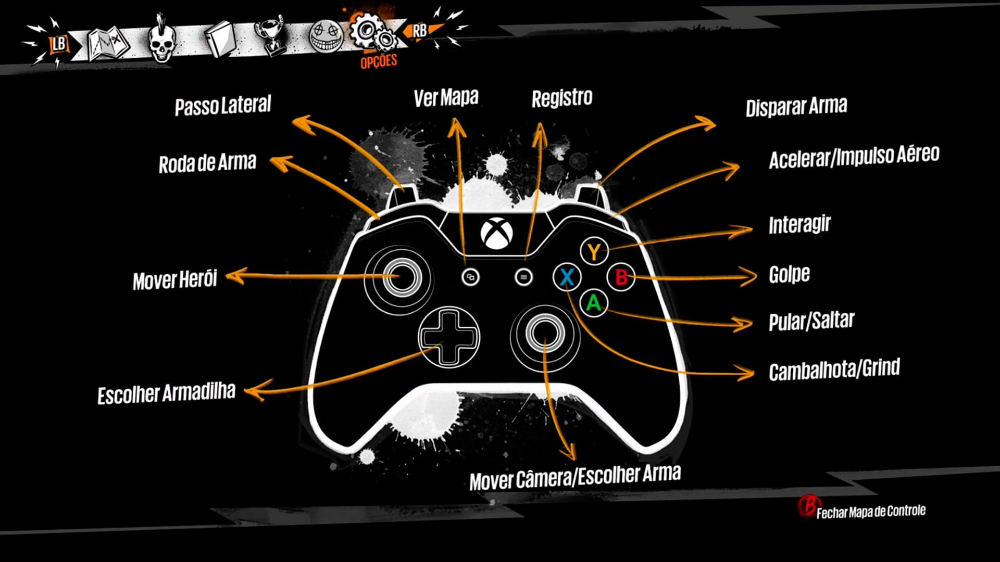

# Identidade Visual

<figure><figcaption></figcaption></figure>

## Proposta

A narrativa do jogo vai ser contada pelo cenário, descrição dos itens, cartas colecionáveis e cutscenes.&#x20;

O não vai possuir diálogos ou narrativa com voz, apenas grunhidos como Hollow Knight, vai ser utilizado cutscenes tipo teatro de papel, papelão, inspirado nas do Battleblock Theater e com alguma forma de narrativa, que nem no começo de Irmão Urso, o jogo Tchia ou como se fosse uma história com identidade de um livro de contos. Com gameplay com gráfico e animações simplificadas tipo Hollow Knight.

## Moodboard

<figure><figcaption>
Mo Astray, Nine Sols, Rose and Locket, Hollow Knight and Silksong
</figcaption></figure>

<figure><figcaption>
Referencias de HollowKnight, Rayman e Ori and the blind forest
</figcaption></figure>

<figure><figcaption>
Arte e Padrões Indígenas
</figcaption></figure>

<figure><figcaption>
Arquitetura Indígena brasileira
</figcaption></figure>

<figure><figcaption>
Flora nativa do Brasil e algumas espécies de fungos
</figcaption></figure>

## Representação das Cores - Progressão e Ambiente

_Descrito melhor na sessão de Narrativa - WorldBuilding e Storytelling._

<figure><figcaption>
Cor dos elementos abaixo
</figcaption></figure>

<strong>Verde</strong>

Terra representando a natureza, Floresta Densa, Próximo a Fontes de água. Insetos, animais e criaturas relacionadas à região, fungos entre outros. Sinergia com a energia da cor Azul.

**Significado da Cor -** Calma, Umidade, Amizade, Saúde, Tranquilidade. Decisões, pensamento abstrato e criativo, respostas afetivas, e capacidade para conexões emocionais e julgamento social, frescor, esperança, amizade, equilíbrio, ecológico, umidade, primavera, natureza, paz, saúde, ideal, abundância, tranquilidade, suavidade, descanso além de tolerância.

Marrom

É a cor da terra e da madeira e por isso está também associada à natureza.

**Significado da Cor -** Transmite uma sensação de calma, conforto físico e qualidade. Muitas vezes associado à segurança e prosperidade material, com a aquisição de bens. Segundo a cultura ocidental, o marrom representa a seriedade, maturidade, estabilidade e responsabilidade.

<strong>Azul</strong>

Água e ambiente húmido, criaturas e plantas aquáticas, cavernas úmidas, pântanos, fungos etc. Sinergia com o elemento Terra.

**Significado da Cor -** Inspiração, Vastidão, Afeto, Amizade e Confiança. Poder, produtividade, sucesso, sobriedade, sofisticação, inspiração, profundidade, mar, céu, gelo, espaço, verdade, afeto, intelectualidade, serenidade, infinito, meditação, amizade, confiança.

<strong>Amarelo</strong>

Vento, regiões altas e montanhosas. Possui sinergia com o com o Vermelho, o elemento do Fogo.

**Significado da Cor -**A cor amarela desperta frescor, traz leveza, descontração, otimismo. Simboliza criatividade, juventude, sabedoria, conhecimento, relaxamento, alegria, felicidade, idealismo, imaginação, esperança, claridade, verão e perigo.

<strong>Vermelho</strong>

Fogo, Regiões, Vulcões, Desertos e ambientes artificiais, tomados por máquinas, destruição e caos. Sinergia com a energia Turquesa.

**Significado da Cor -** Energia, Dinamismo, Ação, Emoção e Intensidade. Pecado da carne, paixão, sedução, transgressão, guerra, perigo, fogo, sol, dinamismo, força, energia, revolta, coragem, barbarismo, intensidade, vigor, violência, excitação, ação, agressividade, estímulo a se alimentar (fogo tem que queimar alguma coisa, e as máquinas se alimentam da natureza, fogo, a queima).

Cinza

Representando o Artificial, Plástico, Metal, Cimento, as Máquinas, o que dilui o preto da morte, tirando sua essência, deixando impuro, não natural.

**Significado da Cor -** Neutralidade, pó, chuva, máquinas, tédio, tristeza, decadência, velhice, desânimo, sabedoria, passado, elegância, sutileza.

Branco

Representa a entidade da Vida;

**Significado da Cor -** Neutralidade, pureza, vida, limpeza, castidade, liberdade, criatividade, infância, harmonia, divindade e paz.

<strong>Preto</strong>

Representando a entidade da Morte, o que o artificial solta, piche, óleo, resultado da queima da natureza resultando no preto e cinza, concreto, o que movimenta as Máquinas Autônomas, destruição. Sinergia com o Branco, representação da Vida.

**Significado da Cor -** Enterro, funeral, noite, coisas obscuras, fim, mal, miséria, temor. Entretanto também está associado a sofisticação e requinte (as máquinas, tecnologia no caso).

## Color script

<figure><figcaption></figcaption></figure>

Lorem ipsum dolor sit amet, consectetur adipiscing elit. Mauris maximus mollis orci, ut ornare nunc sollicitudin sed. Morbi nec suscipit nunc. Nullam pulvinar vestibulum quam, eget porta justo euismod quis. Nullam faucibus accumsan dignissim. Sed eu arcu eget leo ultricies consequat. Etiam scelerisque viverra ex in blandit.

Curabitur nec tincidunt leo. Maecenas ut pharetra leo. Vestibulum fermentum faucibus malesuada. Proin laoreet suscipit facilisis. Praesent aliquam venenatis arcu quis pretium. Nullam vitae tincidunt lectus, in dignissim nisi. Phasellus feugiat volutpat nisl. Nullam molestie consequat porttitor. Etiam dolor nisi, suscipit ac rhoncus sit amet, lobortis ac arcu. Fusce at magna mollis, iaculis velit malesuada, viverra erat. Curabitur tempor ex vel magna vehicula laoreet. Integer rhoncus tincidunt sem, quis pretium urna egestas nec.

