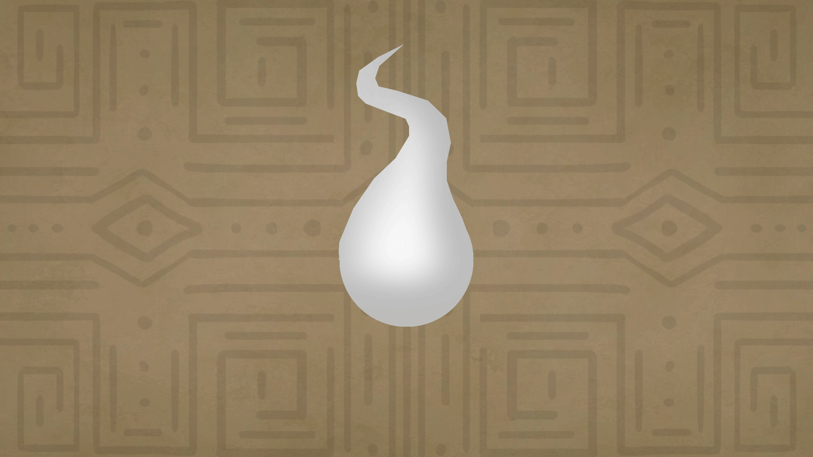

# Sistema Monetário

<figure><figcaption>
Essência
</figcaption></figure>

Todos os seres vivos possuem sua própria **"essência",** devido o equilíbrio entre a vida e a morte ter sido quebrado, a morte não consegue mais dar fim aqueles que estão no fim de suas forças vitais, não conseguem manter sua essência e se perdem pois a morte não está lá para coletar ela. Por conta disso acabou virando um bem, algo valioso, algo que todos até os que saudáveis querem.

**Durante o jogo será possível obter essências de três formas:**

1. Descobrindo e abrindo baús que dão essências;
2. Ao atordoar inimigos se ganha uma quantidade de essências - CADA inimigo possui um numero "X" de vezes que dará ao jogador, durante o jogo inteiro.
3. Coletando objetos, relíquias e tesouros nos baús e vendendo a uma loja.
