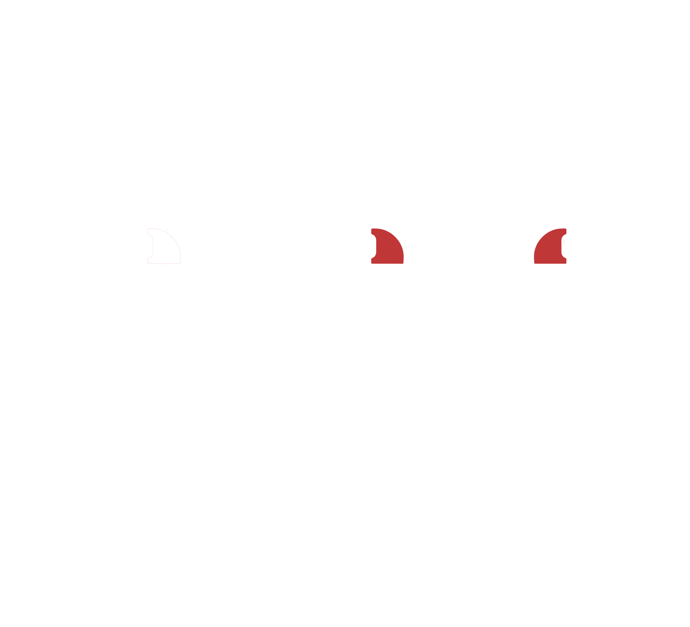

# Controles

## Ações

* Movimentar;
* Interagir;
* Pular;
* Dar Investida - Dash;
* Dar Contra Ataque - Parry;
* Direcionar Contra ataque;
* Se defender - Escudo;
* Trocar Elemento - Energia.

## Mapeamento

<figure><figcaption>
Mapa de Controles
</figcaption></figure>

