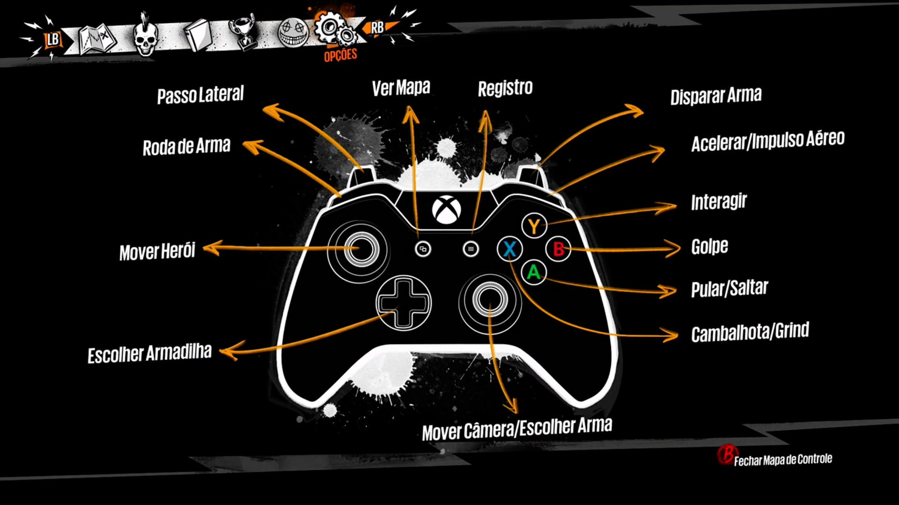

# Controles

## Ações

* Movimentar;
* Interagir;
* Pular;
* Dar Investida - Dash;
* Dar Contra Ataque - Parry;
* Direcionar Contra ataque;
* Se defender - Escudo;
* Trocar Elemento - Energia.

## Mapeamento

### Teclado e mouse

<figure><figcaption></figcaption></figure>

* Troca Elemento - Energia - 1, 2, 3, 4, 5;
* Escudo - Botão Direito do Mouse;
* Direcionar Contra ataque - Mouse;
* Contra Ataque - Parry - Botão Esquerdo do Mouse;
* Investida - Dash - Shift;
* Pulo - Espaço;
* Interação - E;
* Movimentação - W, A, S, D.

### Controle

<figure><figcaption>
Imagem MockUP
</figcaption></figure>

Lorem ipsum dolor sit amet, consectetur adipiscing elit. Mauris maximus mollis orci, ut ornare nunc sollicitudin sed. Morbi nec suscipit nunc. Nullam pulvinar vestibulum quam, eget porta justo euismod quis. Nullam faucibus accumsan dignissim. Sed eu arcu eget leo ultricies consequat. Etiam scelerisque viverra ex in blandit.

