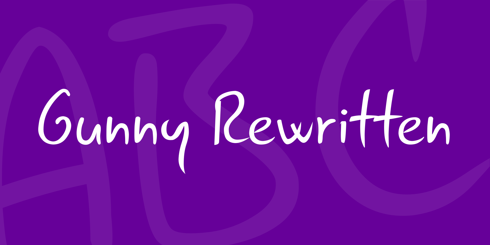
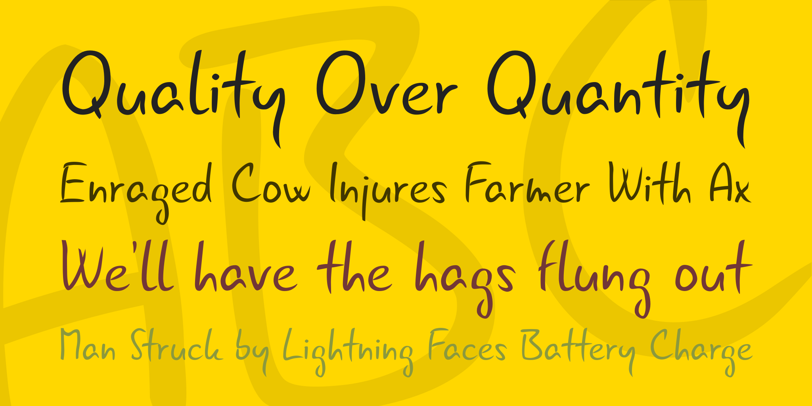
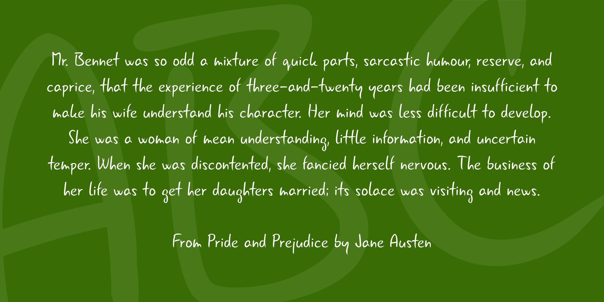
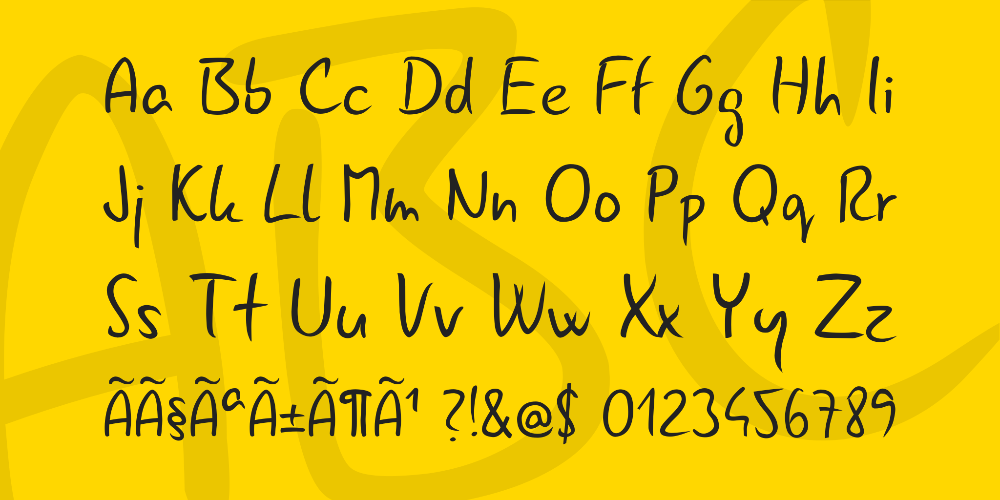

# Interfaces

## Wireframe

<figure><figcaption>
Menu Inicial
</figcaption></figure>

<figure><figcaption>
Configurações no Menu Principal e In game
</figcaption></figure>

<figure><figcaption></figcaption></figure>

 

<figure><figcaption></figcaption></figure>

 

<figure><figcaption></figcaption></figure>

 

<figure><figcaption></figcaption></figure>

<figure><figcaption></figcaption></figure>

<figure><figcaption>
Wireframe in Game - Vida, Energia, Escudo e Menu (ESC)
</figcaption></figure>

<figure><figcaption>
Wireframe in Game - 
</figcaption></figure>

<figure><figcaption>
Wireframe in Game - Inventário de Itens e Colecionáveis
</figcaption></figure>

<figure><figcaption>
Wireframe in Game - Mapa
</figcaption></figure>

<figure><figcaption>
Wireframe in Game - Encicopédia de Inimigos, Armadilhas e Itens
</figcaption></figure>

### Ícones da Interface

<figure><figcaption>
Teste da Interface in Game
</figcaption></figure>

<figure><figcaption></figcaption></figure>

 

<figure><figcaption></figcaption></figure>

<figure><figcaption></figcaption></figure>

 

<figure><figcaption></figcaption></figure>

<figure><figcaption></figcaption></figure>

 

<figure><figcaption></figcaption></figure>

<figure><figcaption>
Concept de exploração da HUD
</figcaption></figure>

<figure><figcaption>
Esboços da HUD
</figcaption></figure>

<figure><figcaption></figcaption></figure>

 

<figure><figcaption></figcaption></figure>

 

<figure><figcaption></figcaption></figure>

<figure><figcaption></figcaption></figure>

 

<figure><figcaption></figcaption></figure>

 

<figure><figcaption></figcaption></figure>

 

<figure><figcaption></figcaption></figure>

## Cores e Tipografias

<figure><figcaption>
Teste de valores das cores das Energias
</figcaption></figure>

Nós optamos por buscar fontes que lembram a estética artística indígena além de fontes com serífa para facilitar a leitura mas uma opção, teste com fontes mais orgânicas, mantendo a estética definida e detalhada na seção abaixo.

<figure><figcaption>
Teste de Tipografias 1
</figcaption></figure>

 

<figure><figcaption>
Teste de Tipografias 2
</figcaption></figure>

<figure><figcaption></figcaption></figure>

 

<figure><figcaption></figcaption></figure>

 

<figure><figcaption></figcaption></figure>

 

<figure><figcaption></figcaption></figure>

<figure><figcaption></figcaption></figure>

 

<figure><figcaption></figcaption></figure>

<figure><figcaption></figcaption></figure>

 

<figure><figcaption></figcaption></figure>

