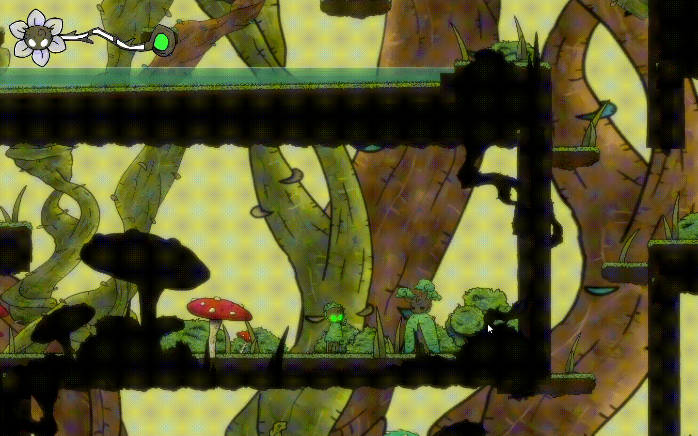

# Mecânicas

## Movimentação e Pulo

* Movimentação básica e Pulo Simples, e na duplo. Pulo em paredes específicas e escalar bordas das plataformas e obstáculos.

<figure><figcaption>
Movimentação
</figcaption></figure>

 

<figure><figcaption>
Pulo
</figcaption></figure>

<figure><figcaption>
Pulo na Parede
</figcaption></figure>

## Dash - Impulso

* Possui Cooldown - Para os lados e para cima ou baixo se não tiver a mecânica de pulo duplo, o dash também atravessa ataques específicos.

<figure><figcaption>
É possível dar o Dash horizontalmente e verticalmente, além das diagonais.
</figcaption></figure>

## Escudo

* Possui Cooldown - Cria um bolha ao redor do protagonista, absorve ataques (não devolve projéteis), a cor do elemento da energia pode ser alterado, para maior eficiência na defesa;

<figure><figcaption>
Uma bolha ao redor do personagem que absorve o dano, porém consome 1 barrinha de resistência.
</figcaption></figure>

<figure><figcaption>
Também é possível alterar a Energia do Escudo, dentre os elementos que o personagem dominou.
</figcaption></figure>

## Parry - Contra Ataque

<figure><figcaption>
Direcionar o projétil rebatido para a direção desejado, utilizando o cursor do mouse.
</figcaption></figure>

* Desbloqueado após obter o Cajado;
* **Possui Cooldown -** Utilizado Para desviar tanto inimigos quanto seus ataques, projéteis ou armadilhas, espinhos;
* Ao dar Parry no ataque de um inimigo, o jogador repele esse ataque na direção que quiser, podendo revidar o ataque para inimigos do mesmo elemento do ataque. É possível também usar esse Parry para baixo, conseguindo um impulso maior que um pulo;
* Por ser jovem, o protagonista não possui ainda a força física necessária para destruir objeto, muito menos tem o intuito de machucar os inimigos, por conta de seus ideais, dependendo de sua energia e seu Cajado para redirecionar os golpes pré-existentes, para conseguir interagir com o cenário e atordoar os inimigos.

<figure><figcaption>
Rebater projéteis para locais de interação.
</figcaption></figure>

Os inimigos são apenas nocauteados ao serem atingidos pelo projetil rebatido, os inimigos se recuperam ao entrar novamente na sala ou após um período de tempo. E ao dar parry para baixo em algum ataque, armadilha, o personagem ganha impulso para cima, conseguindo atingir lugares mais altos.

* Problema - Acessibilidade para daltonismo;
* Solução - Utilizar formas ou estilos diferentes para cada partícula das habilidades e cada cor do parry que funciona com tal tipo de ataque. (Ataque normal, Ataque forte e Especial.

Elementos ligados às cores - Água / Azul, Fogo / Vermelho, Marrom / Terra, Verde / Natureza, Amarelo / Vento. O protagonista começará com a energia verde, tendo que coletar as outras durante o jogo, e durante a DEMO a coletar a Marrom.

## Absorção Elemental

<figure><figcaption>
Ao dar parry, rebater um projétil, o elemento relacionado é absorvido para 1 uso. 
</figcaption></figure>

Habilidade da Máscara - Desbloqueada após obter o Cajado, pois ao dar um Parry, o jogador absorve na máscara o elemento que acabou de redirecionar, essa mecânica será usada nos cenários de formas diferentes, de acordo com a energia absorvida:

**Absorveu Natureza (Verde):**

* Movimentação - Gera um cogumelo para pular e alcançar locais que antes não conseguiria, ou uma Vinha para escalar como uma escada;

**Absorveu Água (Azul Marinho):**

* Abre Caminho - Apaga áreas especificas que estão pegando fogo, para o jogador acessar um lugar secreto ou abrir atalhos, no caso backtracking;

**Absorveu Terra (Marrom):**

* Movimentação - Gera Estruturas para o jogador pular e acessar novas áreas que não conseguiria, ou cria buracos no chão levando a novos locais, podendo ser pequenas áreas com baús por exemplo;

**Absorveu Ar (Amarelo):**

* Movimentação - Gera Nuvens ou redemoinhos para o jogador usar de caminho;

**Absorveu Fogo (Vermelho):**

* Abre Caminho - Queima áreas especificas para o jogador acessar um lugar secreto ou abrir atalhos / backtracking;

Após o jogador absorver um elemento depois de um Parry, ele não poderá tomar dano de inimigos ou dar Parry para um inimigo de um outro elemento, se não perderá o elemento atualmente armazenado. Por exemplo:

Por exemplo, caso o jogador absorva o elemento de Terra após um Parry, pode procurar por um local no mapa que possa utilizar, interagir com esse elemento para progredir, porém para isso o jogador deverá evitar absorver sem querer outros elementos, não podendo levar dano ou dar Parry contra inimigos dos outros elementos, se não o elemento será perdido ou substituído.

## Interações

### **Pontos de Save - Checkpoint**

* Durante o jogo o personagem encontrará pontos de salvamento, normalmente localizadas em regiões seguras. Podendo retornar ao ponto como um Checkpoint após morrer, porém com 1/3 da vida inteira e sem suas "moedas".
* #### Viagem rápida
  * Pode ser realizada para alguns pontos de salvamento especiais, essas são indicadas. Todo local de Checkpoint novo desbloqueado, é um novo destino de viagem rápida, tendo apenas que gastar uma pequena quantidade de Essências (moeda do jogo).
