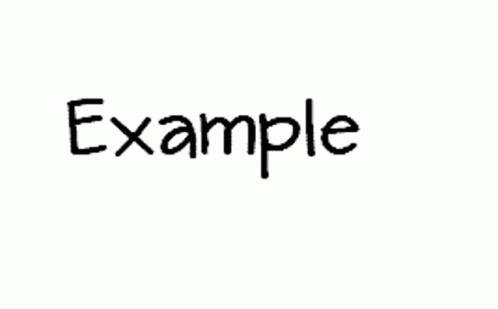

# Parâmetros

## Protagonista - Oquirá

### Movimentação

<figure><figcaption>
Parâmetros: Altura do Personagem, Altura e Distancia do Pulo.
</figcaption></figure>

### Contra Ataque - Parry

<figure><figcaption>
A ser definido
</figcaption></figure>

Área de colisão, distancia e a velocidade de viagem do projétil refletido.

## Inimigos

### Ataques

<figure><figcaption>
A ser definido
</figcaption></figure>

Área de colisão, distancia e a velocidade de viagem do projétil refletido.
