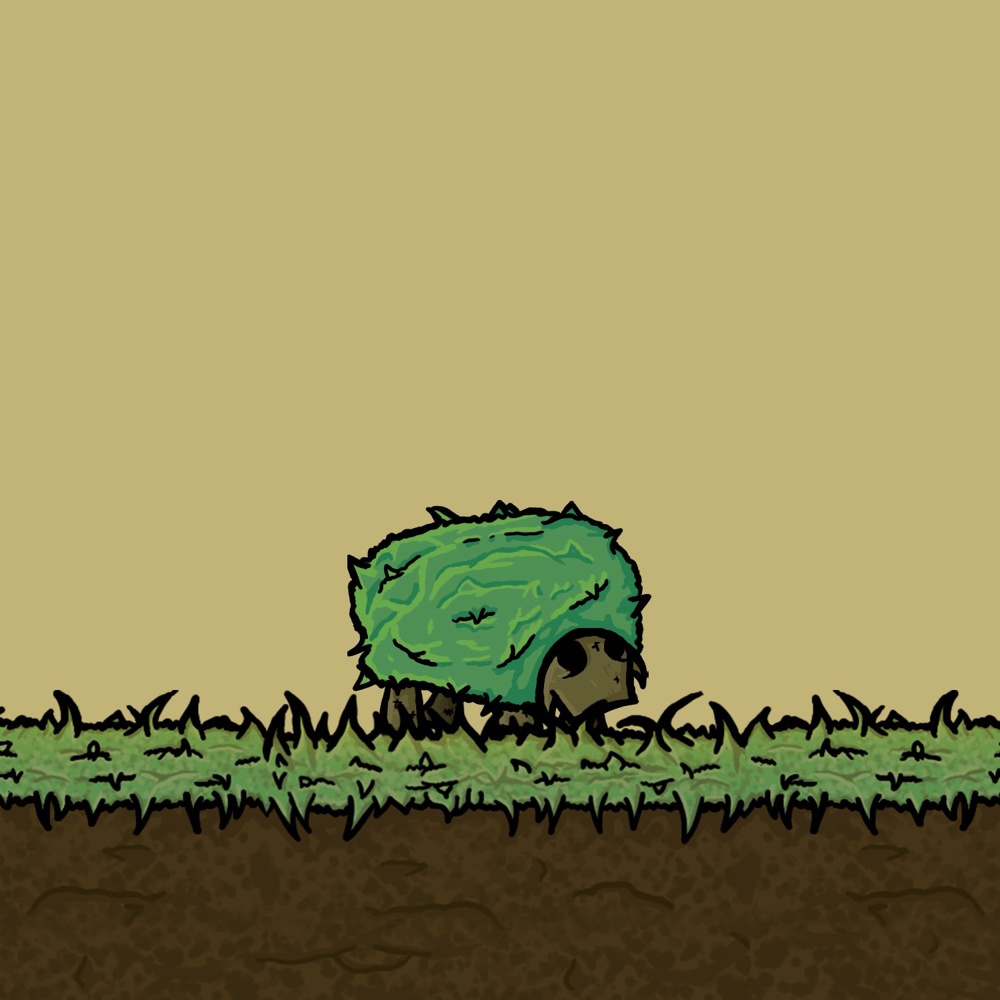
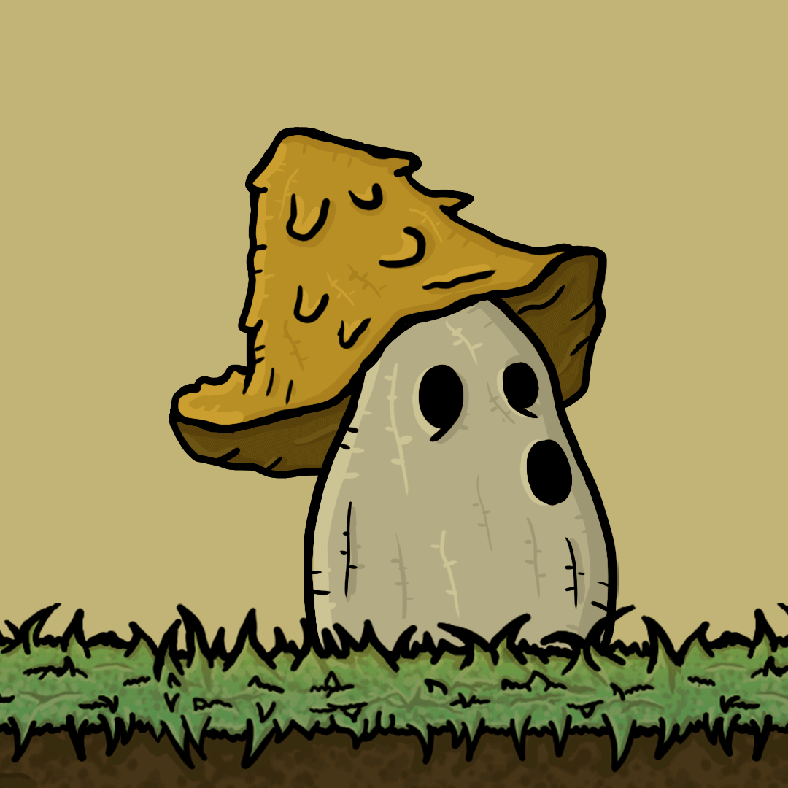
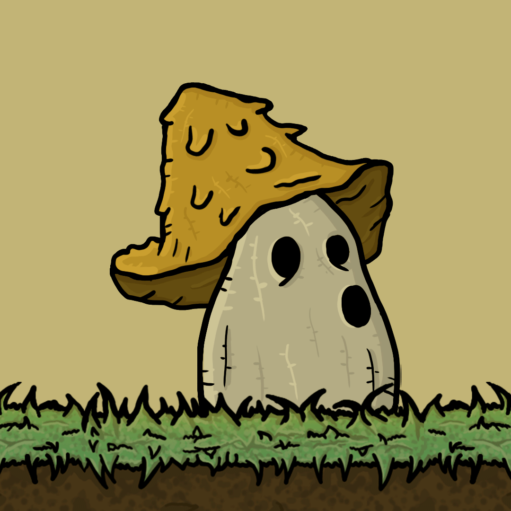
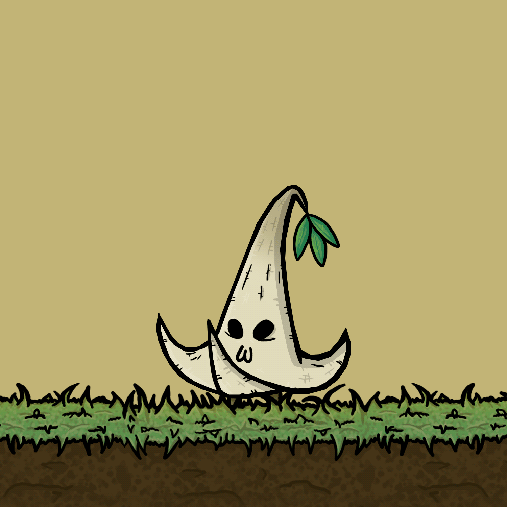
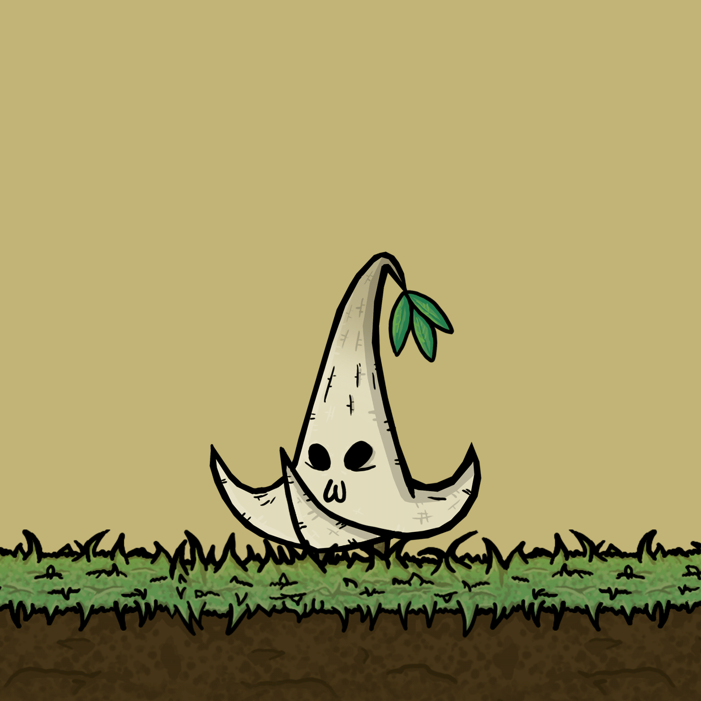
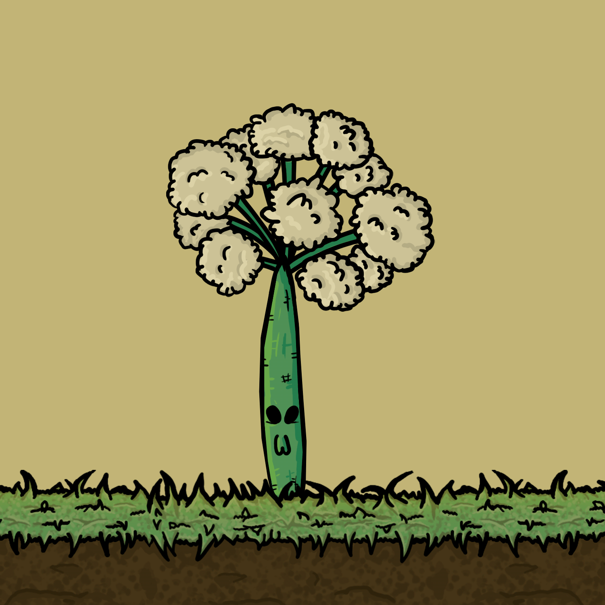
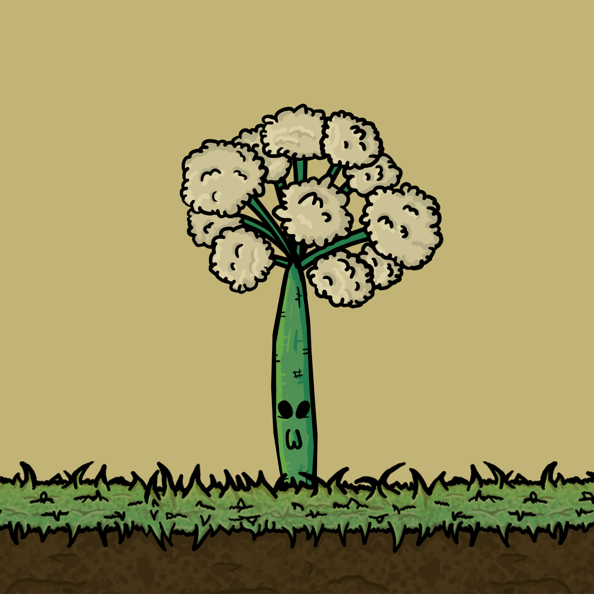
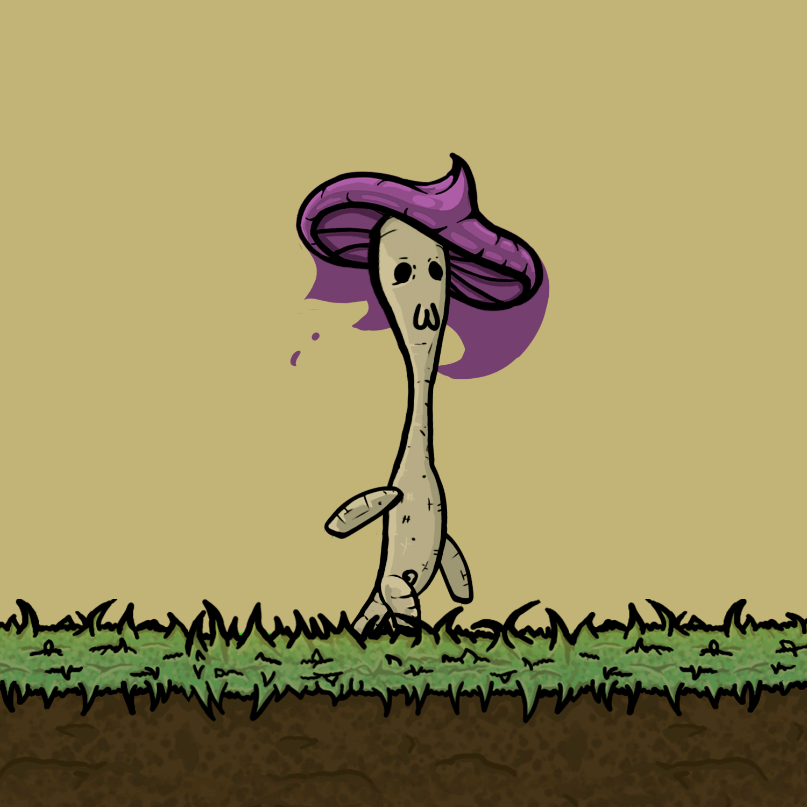
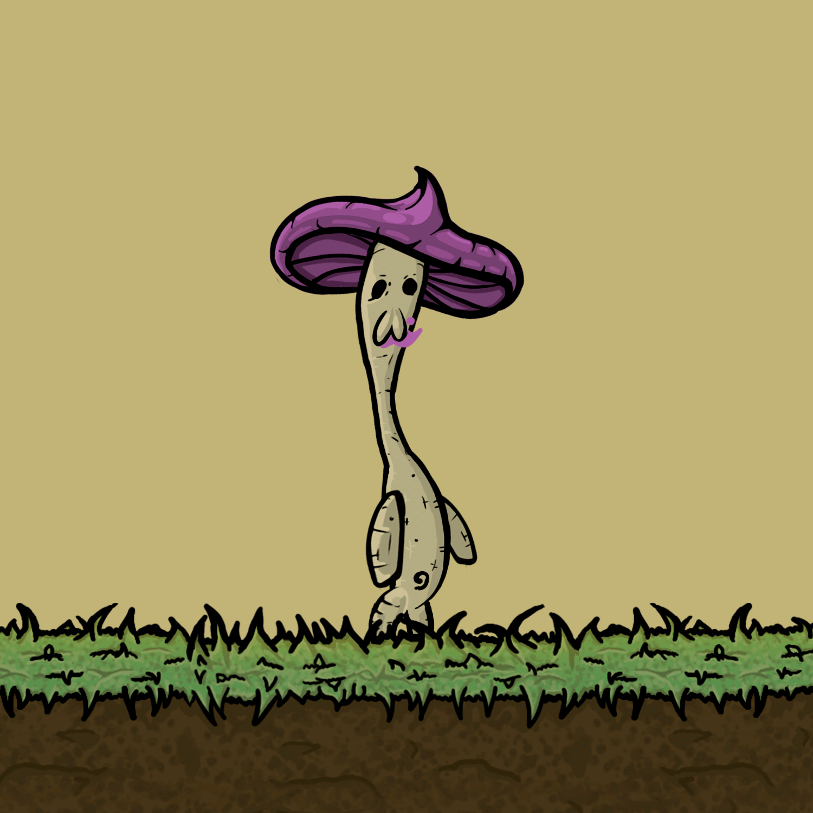
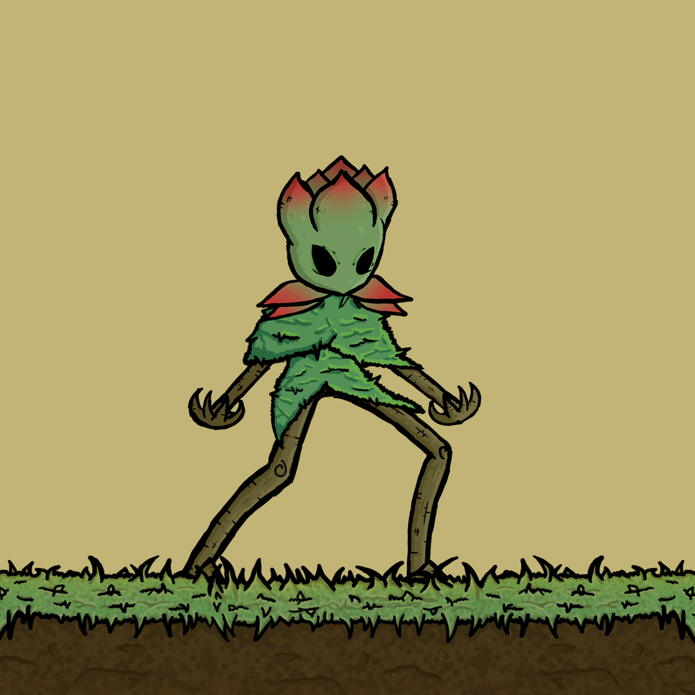

# Inimigos

## Tipos de Inimigos

_Possibilidades de Combinação_

A primeira aparição de qualquer tipo novo de inimigo, ou combinação será vista como um Semi-Boss, muito comum em Souls Like, Hollow Knight etc.

Os inimigos podem ser Artificiais, Naturais Místicos ou não Místicos. Máquinas, Insetos, Animais, Criaturas Elementais: Verde, Marrom, Azul, Amarelo, Vermelho, Cinza.

* Inimigos Normais com Andar;
* Inimigos com Defender;
* Inimigos com Esquivar;
* Inimigos com Perseguir / Investida;
* Inimigos com Voar;
* Inimigos com Planar;
* Inimigos com Saltar;
* Inimigos que Nadam;
* Inimigos com ataque a Distância;
* Inimigos com ataque de proximidade.

## Enemies Animations

<figure><figcaption>
Caubi Idle  - Animation By Manuella Garcia
</figcaption></figure>

 

<figure><figcaption>
Caubi Attack  - Animation By Manuella Garcia
</figcaption></figure>

<figure><figcaption>
Marani Idle  - Art &#x26; Animation By Vinícius Alves
</figcaption></figure>

 

<figure><figcaption>
Marani Attack - Art &#x26; Animation By Vinícius Alves
</figcaption></figure>

<figure><figcaption>
Itacira Idle - Art &#x26; Animation By Manuella Garcia
</figcaption></figure>

 

<figure><figcaption>
Itacira Walking - Art &#x26; Animation By Manuella Garcia
</figcaption></figure>

 

<figure><figcaption>
Itacira Attacking - Art &#x26; Animation By Manuella Garcia
</figcaption></figure>

<figure><figcaption>
Capotira Idle - Art &#x26; Animation By Manuella Garcia
</figcaption></figure>

 

<figure><figcaption>
Capotira Attack - Art &#x26; Animation By Manuella Garcia
</figcaption></figure>

<figure><figcaption>
Ipojuca Walk - Animation By Rafael Ramos
</figcaption></figure>

 

<figure><figcaption>
Ipojuca Attack - Animation By Rafael Ramos
</figcaption></figure>

<figure><figcaption>
Taciatã Walk - Animation By Rafael Ramos
</figcaption></figure>

 

<figure><figcaption>
Taciatã Attack - Animation By Rafael Ramos
</figcaption></figure>

<figure><figcaption>
Extra Enemies
</figcaption></figure>

