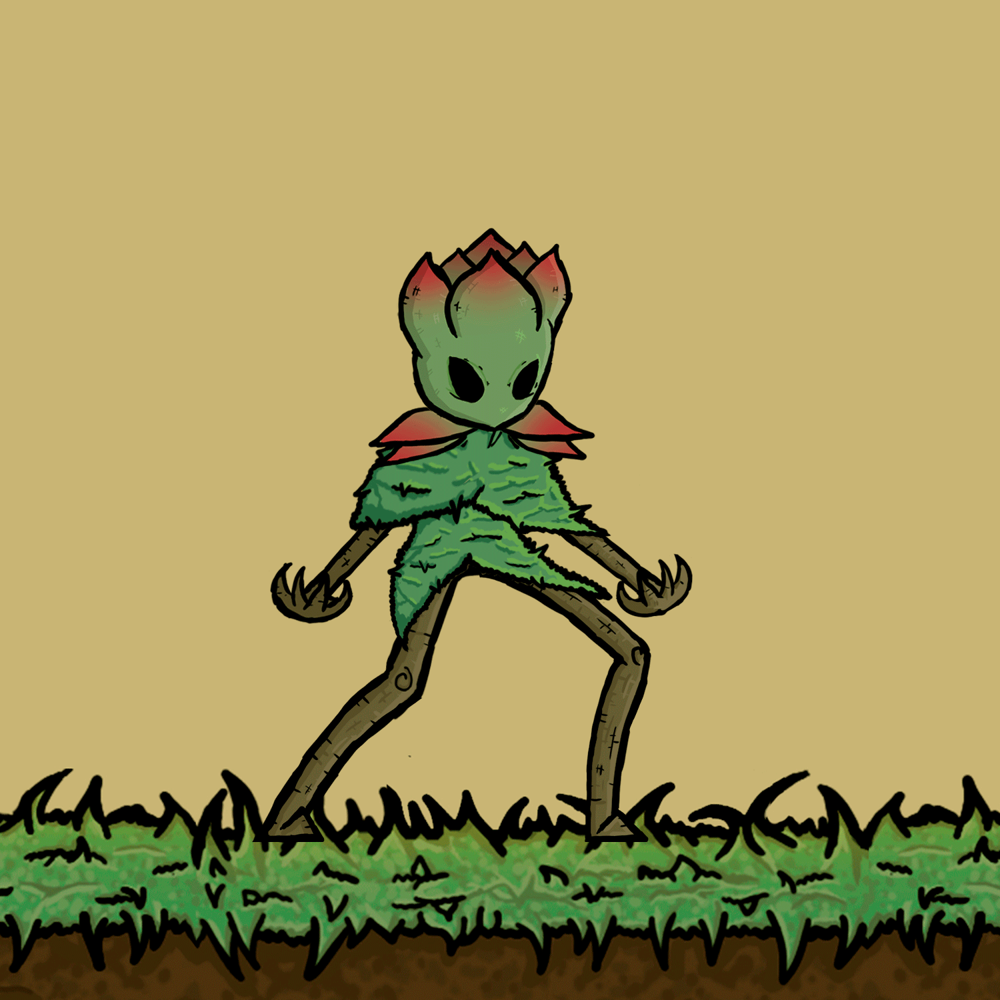

# Inimigos

## Tipos de Inimigos

_Possibilidades de Combinação_\\

A primeira aparição de qualquer tipo novo de inimigo, ou combinação será vista como um Semi-Boss, muito comum em Souls Like, Hollow Knight etc.

Os inimigos podem ser Artificiais, Naturais Místicos ou não Místicos. Máquinas, Insetos, Animais, Criaturas Elementais: Verde, Marrom, Azul, Turquesa, Vermelho, Cinza.\\

* Inimigos Normais com Andar;
* Inimigos com Defender;
* Inimigos com Esquivar;
* Inimigos com Perseguir / Investida;
* Inimigos com Voar;
* Inimigos com Planar;
* Inimigos com Saltar;
* Inimigos que Nadam;
* Inimigos com ataque a Distância;
* Inimigos com ataque de proximidade.

#### Tags - Inimigos podem também possuir TAGS de personalidade Inspirado em Pac-Man:

* Comandante;
* Presa / Medroso;
* Caçador / Perseguidor;
* Valentão;
* Tímido;
* Animado / Elétrico;
* Chorão.

<figure><figcaption>
Bajé Idle
</figcaption></figure>

<figure><figcaption>
Bajé Andando
</figcaption></figure>

<figure><figcaption></figcaption></figure>

<figure><figcaption></figcaption></figure>

<figure><figcaption>
Taciatã Atacando
</figcaption></figure>
