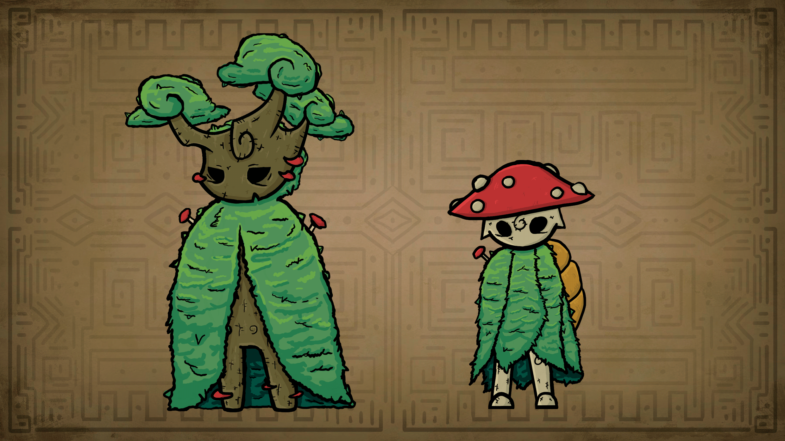

# NPCs

**Entidades**

* Vida - Representada pela cor Branca;
* Morte - Representada pela cor Preta.\

**Anciões**

Durante muitas eras foram os representantes e guardiões de cada um dos elementos, os escondendo para que não caísse nas mãos do Artificial. &#x20;

* Ancião da Natureza - Elemento inicial do personagem;
* Ancião da Terra;
* Ancião da Água;
* Ancião do Vento - Corrompido - Boss - DESAPARECIDO;
* Ancião do Fogo - Corrompido - Boss - DESAPARECIDO.\

**Mentor -** Dica, Tutorial e Treinamento das mecânicas;\

**Vendedores - Itens e Power UPs:**\

* Vila da Floresta;
* Vila do Lago e Pântano;
* Vila da Montanha;
* Vila do Vulcão;
* Viajante.\

**Robô Jardineiro -** O único robô do bem.\

**Vidente e Cartomante -** Dicas de progressão.\

**Insetos -** Missões, cada um dá um item único se completar sua Quest.\

* Inseto Contador de Histórias - Em troca de dinheiro;
* Inseto Assustado - Que Grita;
* Inseto que Dança (referencia a hora de aventura);
* Inseto que Canta;

**Dançarina das Águas -** Quest com item único de recompensa.

<figure><figcaption>
O Mentor &#x26; o Vendedor Viajante da Natureza - Animation By Manuella Garcia
</figcaption></figure>

