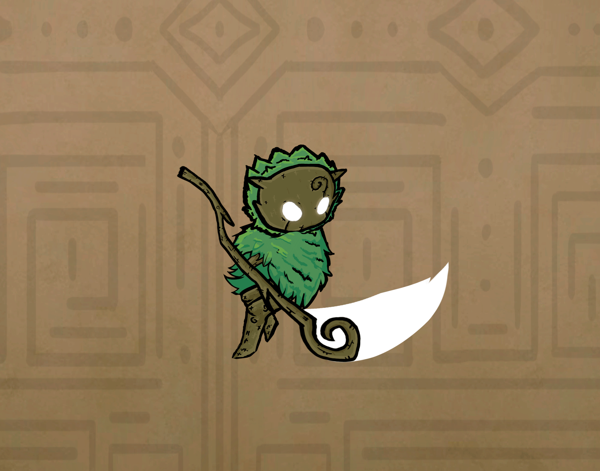

# Personagem do Jogador

<figure><figcaption>
Idle do personagem principal
</figcaption></figure>

## O(a) Escolhido(a)

Oquirá, o(a) escolhido(a), protagonista do jogo, vindo da aldeia das Flores, do distrito do Broto. Faz parte da tribo da Floresta, seres geralmente pacíficos. O personagem principal é uma criatura inocente e jovem que foi escolhida pelo cajado (pela energia ancestral contida nele), para que consiga trazer o equilíbrio de volta.&#x20;

Agora é possível manipular outros elementos sem ser o de Terra do personagem (energia marrom), para passar por obstáculos e desafios que possa encontrar.&#x20;

A energia da cor é representada pelo  brilho de seus olhos, podendo alterar entre os 4 elementos, sendo o único personagem que possui tal brilho, além de partículas com símbolos diferentes o que os tornam mais fáceis de diferenciar.

Por ser jovem, o protagonista não possui ainda a força física necessária para destruir objetos, muito menos machucar os inimigos, dependendo de sua energia e seu Cajado para redirecionar os golpes pré-existentes, para conseguir interagir com o cenário e atordoar os inimigos.

## A personalidade do(a) Escolhido(a)

Cheia de Vida, é bem humorada, rica em juventude e energia, mais voltada à delicadeza, defesa e sua agilidade.

Tem apreço por toda forma de vida e empatia pela morte, pois diferente de si a morte é solitária, já que sempre traz o fim a ela. Porém o lampejo do calor da vida sempre os aproximam novamente, como Yin e Yang, podendo ao menos apreciar a companhia novamente, mesmo que por um breve período de tempo.

Tendo apreço por toda vida, propositalmente o personagem ao refletir ataques não mataria inimigos, apenas os nocautearia. Caindo moedas ou gemas e se recuperando após um tempo ou sair e retornar a região.

## Outras Animações do Personagem

#### Parry

<figure><figcaption>
Parry Animation By Rafael Ramos
</figcaption></figure>

