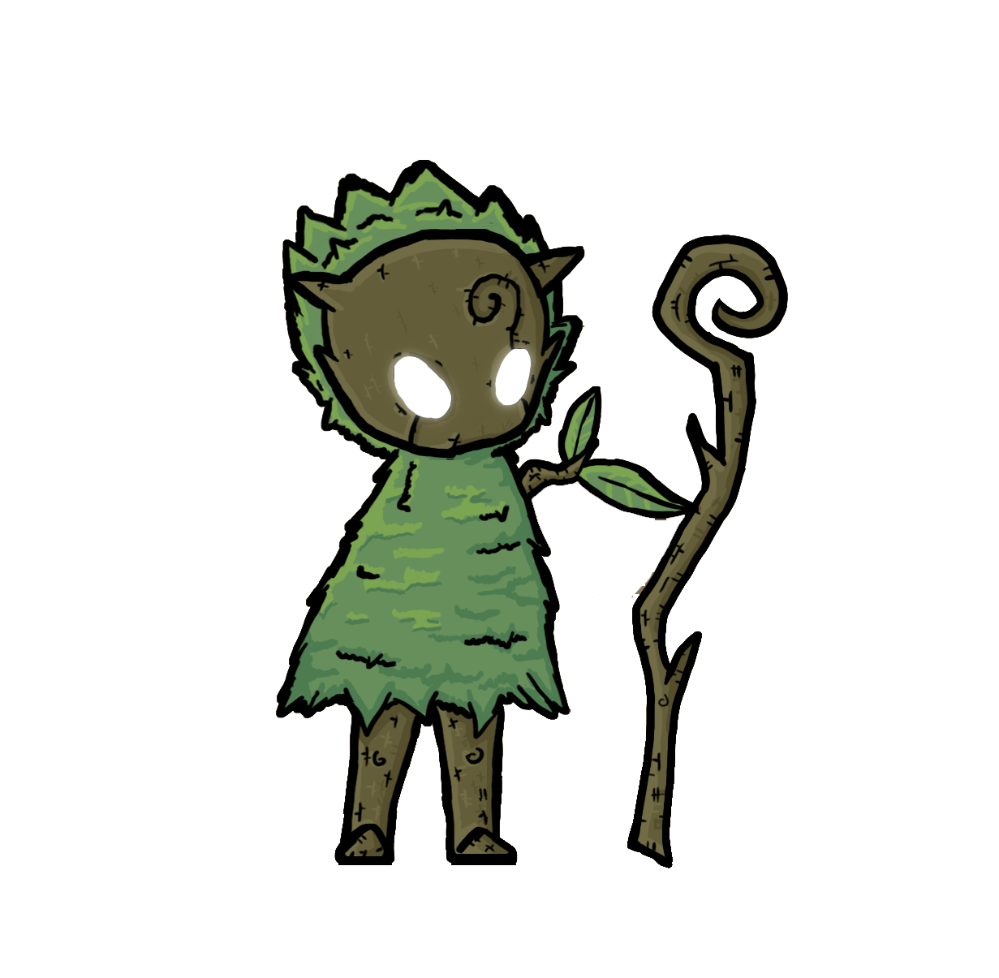
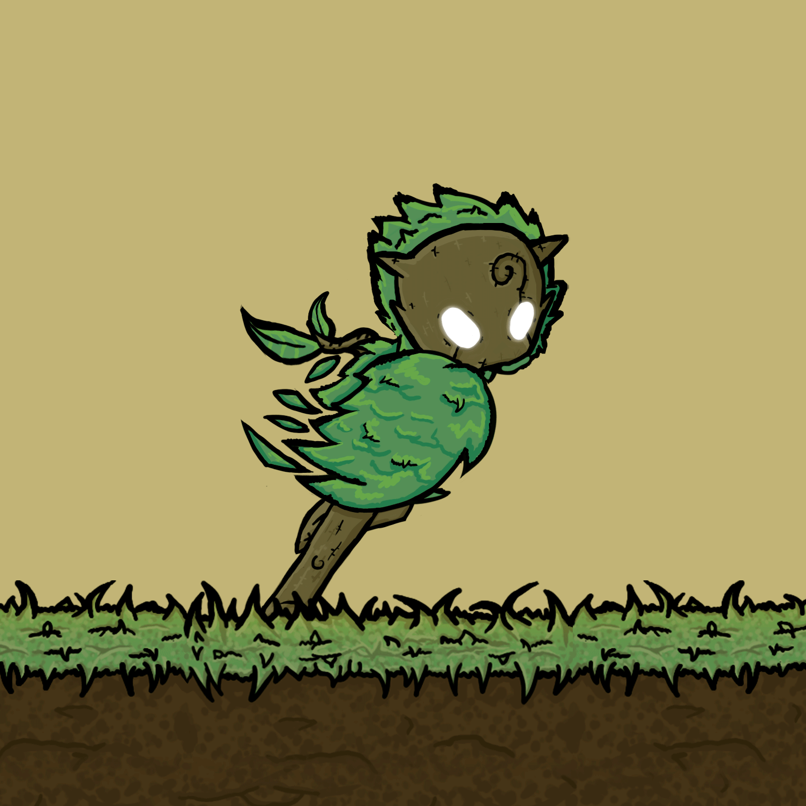
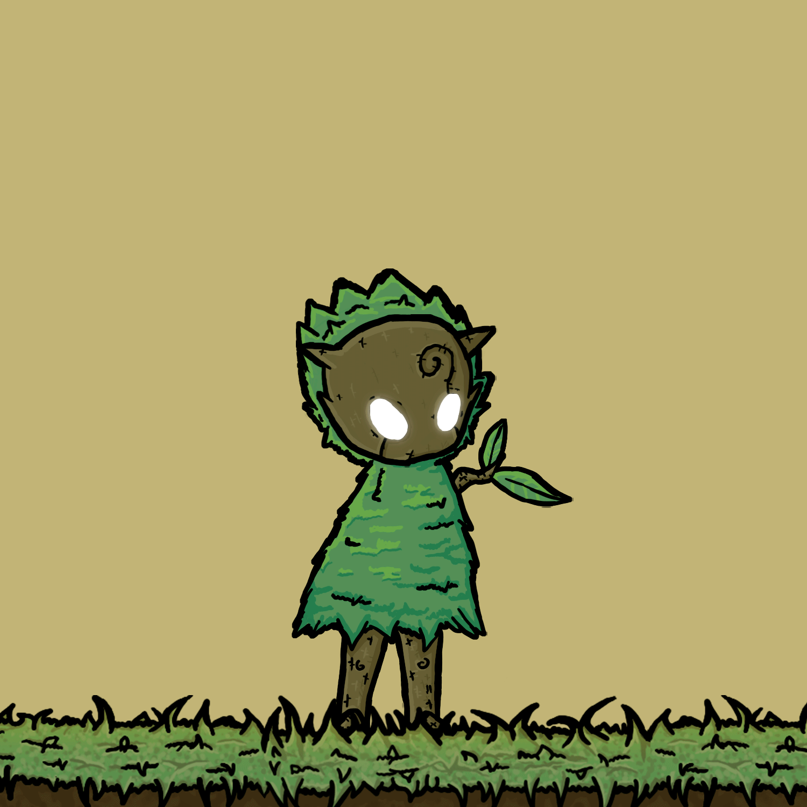
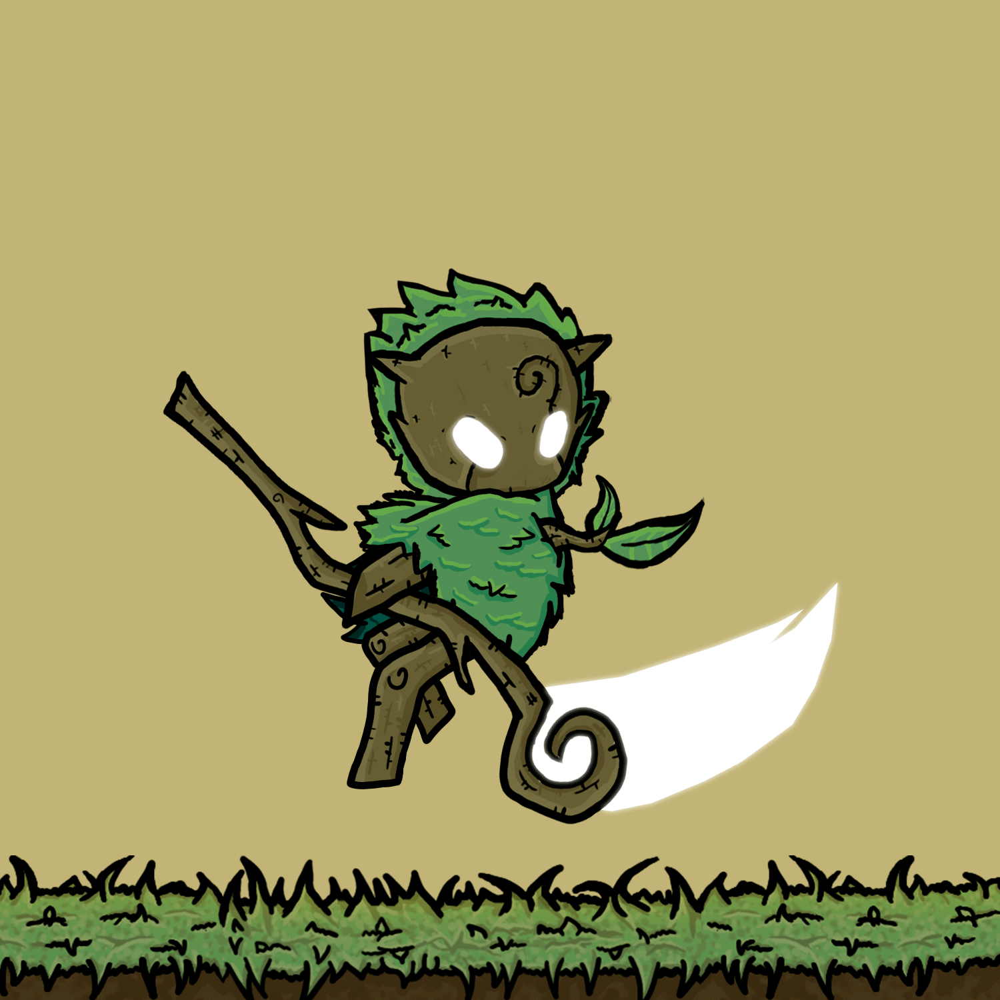
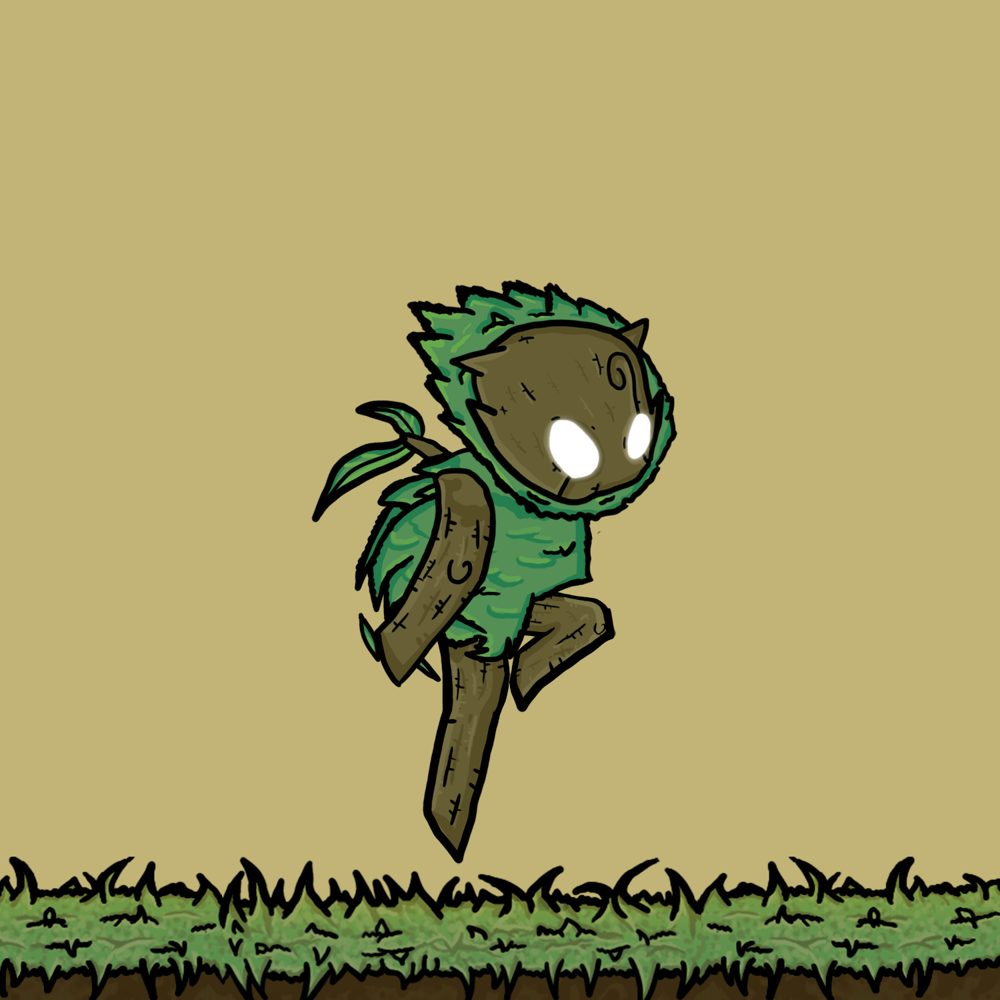
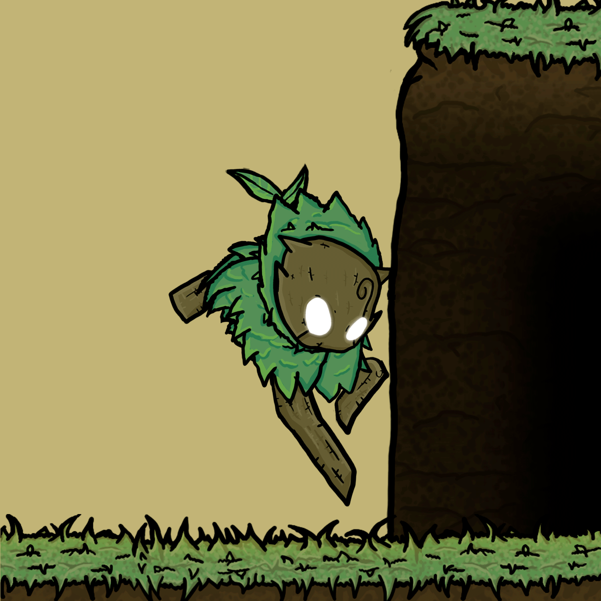
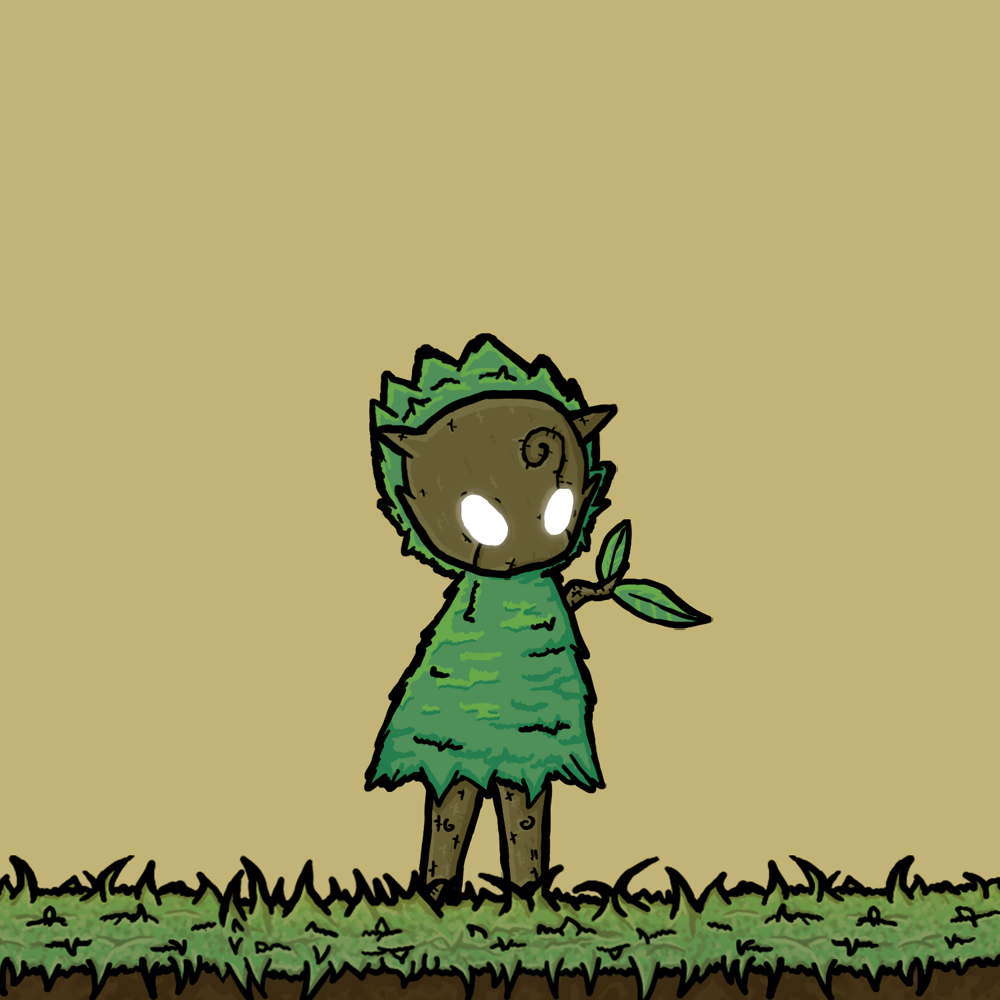
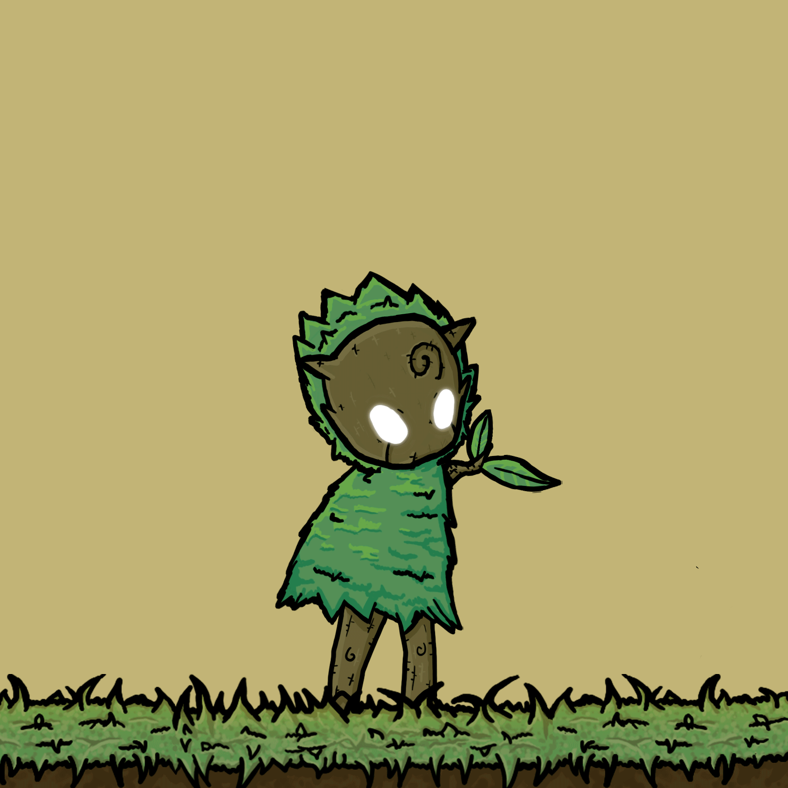

# O Protagonista

<figure><figcaption>
Idle do personagem principal
</figcaption></figure>

<figure><figcaption>
OQUIRÁ
</figcaption></figure>

## O(a) Escolhido(a)

Oquirá, o(a) escolhido(a), protagonista do jogo, vindo da aldeia das Flores. Faz parte da tribo da Floresta, seres geralmente pacíficos. O personagem principal é uma criatura inocente e jovem que foi escolhida pelo cajado (pela energia ancestral contida nele), para que consiga trazer o equilíbrio de volta.

A cor branca  representa a vida e é a combinação de todas as cores. Oquirá tendo sua alma pura, por conta de seus ideais e cultura em que cresceu, é voltada ao budismo e preservação respeito a toda forma de vida, assim como a cor branca pode manipular outros elementos sem ser o seu original.

Apenas assim, tendo uma alma pura sem sede por poder que seria capaz de encarnar a fagulha da vida, esperança e ser escolhido pelo Cajado, após isso é possível canalizar sua própria força vital, sua energia e manipular outros elementos sem ser o de Natureza elemento base do personagem (energia verde), para passar por obstáculos e desafios que possa encontrar durante a jornada.

A cor da energia é representada pelo seu cajado e partículas com símbolos diferentes o que os tornam mais fáceis de identificar, após obtê-lo é possível alterar entre os 5 elementos gerais.

Por ser jovem, o protagonista não possui ainda a força física necessária para destruir objeto, muito menos tem o intuito de machucar os inimigos, por conta de seus ideais, dependendo de sua energia e seu Cajado para redirecionar os golpes pré-existentes, para conseguir interagir com o cenário e atordoar os inimigos.

## A personalidade do(a) Escolhido(a)

Cheia de Vida, é bem humorada, rica em juventude e energia, mais voltada à delicadeza, defesa e sua agilidade.

Tem apreço por toda forma de vida e empatia pela morte, pois diferente de si a morte é solitária, já que sempre traz o fim a ela. Porém o lampejo do calor da vida sempre os aproximam novamente, como Yin e Yang, podendo ao menos apreciar a companhia novamente, mesmo que por um breve período de tempo.

Por conta de sua cultura e ideais, possui apreço por toda vida, propositalmente o personagem ao refletir ataques não mataria inimigos, apenas os nocautearia. Caindo essências e se recuperando após um tempo ou sair e retornar a região.

## Outras Animações do Personagem

<figure><figcaption>
Oquirá Walk - Animation By Rafael Ramos
</figcaption></figure>

 

<figure><figcaption>
Oquirá Jump - Animation By Rafael Ramos
</figcaption></figure>

<figure><figcaption>
Oquirá Parry - Animation By Rafael Ramos
</figcaption></figure>

 

<figure><figcaption>
Oquirá Dash - Animation By Rafael Ramos
</figcaption></figure>

 

<figure><figcaption>
Oquirá Wall Grab and jump - Animation By Rafael Ramos
</figcaption></figure>

<figure><figcaption>
Oquirá Interaction - Animation By Rafael Ramos
</figcaption></figure>

 

<figure><figcaption>
Oquirá Hit - Animation By Rafael Ramos
</figcaption></figure>

