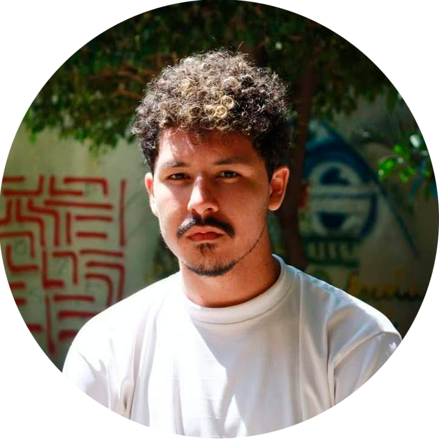

# Sobre o Estúdio

<figure><figcaption></figcaption></figure>

Formado no começo de 2023, porém com uma história que data até 2018. O nosso intuito foi criar uma empresa com nossos amigos, nossa cara, valores e objetivos.

Utilizando nosso conhecimento prévio e experiência no desenvolvimento de outros games, para abrir uma empresa indie, mas principalmente criar experiências memoráveis que farão parte dos jogadores, para o resto de suas vidas!

A capivara além de representar um animal Sul Americano encontrado no Brasil, passa a sensação de tranquilidade e controle mesmo em momentos de tensão. Como em toda produção que envolve criatividade e projetos complexos, um caos que estamos acostumados felizmente.

Incluímos em nossos jogos a nossa essência. Trazendo além de temas importantes, reflexões que irão contribuir para nosso presente e futuro, histórias profundas e tocantes, tudo sem abrir mão da diversão, do lado lúdico que está dentro de todos.

Mas qual motivo disso? É importante lembrar do passado para não repetirmos os mesmos erros, enxergar a realidade como ela é, porém sem perder a esperança, motivando e cultivando nos jovens uma mentalidade poderosa! Pois isso a longo prazo trás enormes mudanças que são significativamente positivas ao Mundo e além da Sociedade.

## A Equipe

<table data-view="cards"><thead><tr><th align="center"></th><th></th><th align="center"></th><th data-type="content-ref"></th><th data-type="content-ref"></th></tr></thead><tbody><tr><td align="center"><strong>Juan Nolasco</strong> <em>@</em> </td><td></td><td align="center"> • Design de Som </td><td></td><td><a href="https://www.artstation.com/juannolasco">https://www.artstation.com/juannolasco</a></td></tr><tr><td align="center"><strong>Luiz Harsche</strong> <em>@</em>theharsche </td><td></td><td align="center">
 • Programação

• Game Design

• Level Design
</td><td><a href="https://luizharsche.wixsite.com/portfolio">https://luizharsche.wixsite.com/portfolio</a></td><td><a href="https://www.linkedin.com/in/luizharsche/">https://www.linkedin.com/in/luizharsche/</a></td></tr><tr><td align="center"><strong>Manuella Garcia</strong> <em>@</em>manuh.cg </td><td></td><td align="center">
 • Animações

• Concept Art
</td><td></td><td><a href="https://www.artstation.com/manuhcass">https://www.artstation.com/manuhcass</a></td></tr><tr><td align="center"><strong>Victor Crepardi</strong> <em>@ViktorCrepardi</em> </td><td></td><td align="center">
 • Produção • Direção Criativa • Concept Art / Ilustrações

• Roterista 
</td><td><a href="https://viktorcrepardi.myportfolio.com/">https://viktorcrepardi.myportfolio.com/</a></td><td><a href="https://www.linkedin.com/in/viktorcrepardi/">https://www.linkedin.com/in/viktorcrepardi/</a></td></tr><tr><td align="center"><strong>Vinícius Alves</strong> @<em>alvessf</em> </td><td></td><td align="center"> • Direção de Arte • Concept Art / Ilustrações • Interfaces / UI &#x26; UX </td><td></td><td><a href="https://viniciusasfreitas.wixsite.com/portfolio">https://viniciusasfreitas.wixsite.com/portfolio</a></td></tr><tr><td align="center"><strong>Rafael Ramos</strong> <em>@</em>ipocantus </td><td></td><td align="center">
 • Animações

• StoryBoard 
</td><td><a href="https://rafa123el3.wixsite.com/ipocantuscuda">https://rafa123el3.wixsite.com/ipocantuscuda</a></td><td></td></tr></tbody></table>
